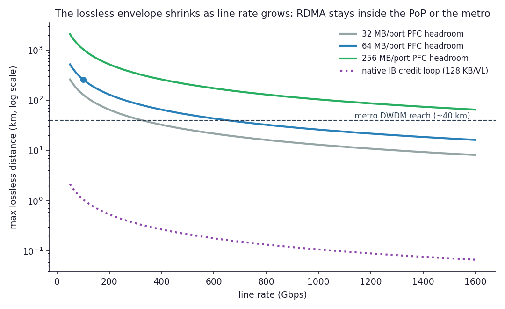
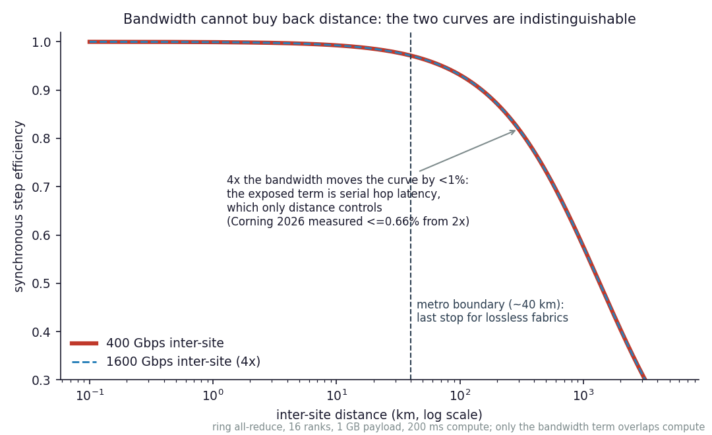
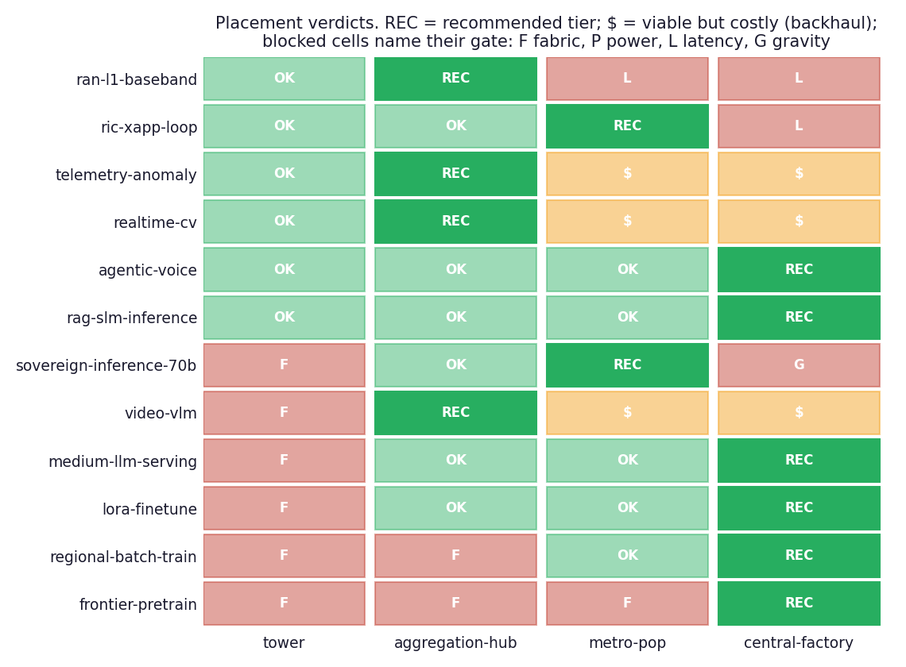

# Placement on the edge↔neocloud continuum: centralize by default, edge when forced

Reference numbers point to [REFERENCES.md](../REFERENCES.md). Every verdict
in this study reproduces with `python3 -m continuum.cli matrix`; every
physics number with `python3 -m continuum.cli physics`.

## The question

AI-RAN vendors pitch "an AI factory at every tower" [19, 20, 22]; neoclouds
pitch a GPU region reachable over the WAN [25]. Between them sits a real
engineering question that neither pitch answers: **for a given workload,
which tier of the operator's physical footprint — tower, aggregation hub,
metro PoP, central factory — is the right home, and what exactly forces
that choice?**

This repo answers it with a gate cascade instead of an opinion. Four tiers
(`tiers.py`), each defined by what its physical envelope permits; twelve
workload profiles (`workloads.py`), each reduced to the variables that
decide placement; five gates (`place.py`) that can force or forbid a
placement. The rule the engine encodes: **centralize by default — scale
economies live at the top of the ladder — and place edgeward only when a
named constraint forces it.** If the recommendation sits below the central
factory, the engine tells you which gate pushed it down. That gate is the
reason the edge tier exists for that workload.

## The four tiers are physics, not org charts

| | tower | aggregation hub | metro PoP | central factory |
|---|---|---|---|---|
| AI power | ~1.5 kW headroom [14] | ~50 kW [14, 26] | MW-class | 100 MW-class |
| cooling | air, unstaffed | liquid-capable, staffed | liquid | liquid |
| heaviest GPU | L4-class, 72 W [12] | H100-class, 700 W | Blackwell-class [15] | Blackwell-class |
| fabric | none (PCIe in one box) | pod (≤64 GPUs) | full (~2k GPUs) | full (~100k) |
| distance to user | ~2 km | ~15 km | ~40 km | ~500 km |

Three of these boundaries deserve defending, because everything downstream
follows from them:

**The tower's envelope is 1–2 small GPUs, not a factory.** A macro site
draws 2.5–19 kW for the *radio*; the AI headroom is the rectifier margin —
we grant 1.5 kW, which is generous [14]. It is air-cooled, unstaffed, and
freeze/leak intolerant, so the heaviest hostable part is the 72 W L4-class
silicon NVIDIA itself positions there (ARC-Compact [12]). A 700 W H100 does
not fit the power, the cooling, or the truck-roll model. Modern AI racks
are 40–130 kW liquid-cooled objects [15]; nothing about a tower cabinet
resembles that.

**The hub is the real "edge neocloud."** Central offices and C-RAN hotels
have building power, physical security, staff, and — decisively — an
*existing* power entitlement while greenfield data centers wait ~5–7 years
in interconnection queues [26]. 50 kW feeds a ~52-GPU H100 pod: the
smallest unit that hosts tensor-parallel serving of a 70B-class model.

**40 km is where lossless fabrics end.** The longest-reach InfiniBand
product ever sold (MetroX-3) stops at 40 km, and no AI lab uses even that
[4]. This is not a product gap; it is the physics gate the next section
prices.

## Gate 1 — the physics of distance

Three separate mechanisms close the WAN to tightly coupled traffic, and
they compose into the placement engine's `fabric` and latency-domain gates:

**Propagation is 4.9 µs/km and nothing can be done about it** [1]. The
~100 µs one-way O-RAN 7.2x fronthaul budget [11] therefore draws a ~20 km
circle around every radio: the DU can live at the tower or at a hub within
that circle, never at the metro PoP. `edge-placement evaluate -w
ran-l1-baseband` shows exactly this — tower and hub viable, metro and
central blocked by the fronthaul gate.

**Lossless transport buys distance with buffer, and the price doubles with
line rate.** PFC needs ~2× BDP of headroom per port [2]: 9.5 MB of BDP at
100 G/80 km, 286 MB at 400 G/600 km — versus tens of MB of real packet
buffer on a switch. Native InfiniBand is stricter still: the 12-bit credit
window caps it near 1 km at 100 G [2, 3]. Ultra Ethernet relaxes
losslessness *inside* the fabric [5]; it does not repeal BDP across the
WAN. Practical ceiling: RDMA stays inside the PoP, stretches across a
metro at engineering cost, and does not cross regions.

**For synchronous training, bandwidth cannot buy back distance.** In the
ring all-reduce cost model [10], the bandwidth term can overlap backward
compute, but the 2(n−1) serially chained hops cannot — they drain at the
step boundary. So distance grows the unhideable term while extra bandwidth
attacks only the hideable one. Corning's simulation study puts numbers on
it: near-complete overlap below 10 km, ~26× step-time penalty at 1,000 km
on H100-class nodes, and **at most 0.66% improvement from doubling
bandwidth** [6]. Our model reproduces all three behaviors
(`tests/test_physics.py`), and the industry's own behavior confirms the
boundary: Gemini's multi-datacenter training [8] and Spectrum-XGS's 1.9×
NCCL gain [7] both live at metro-class distances, while Meta trains Llama
3 405B inside one building on RoCE at 400 Gbps per GPU [9].

## Gate 2 — the data journey, and where each protocol gets off the train

Deliverable 2 asks for the journey from aggregation point to edge site.
The honest map is a *protocol ladder* — each rung has a hard reason it
cannot ride further:

| span | protocol | why it ends here |
|---|---|---|
| radio → DU (≤20 km) | eCPRI over fronthaul Ethernet, PTP G.8275.1 [11] | 100 µs one-way budget; ±1.5 µs phase |
| inside pod/PoP | RoCEv2 / InfiniBand (lossless RDMA) | PFC headroom ≈ 2× BDP [2]; credits [3] |
| across the metro (≤40 km) | long-reach lossless over DWDM [4], scale-across Ethernet [7] | buffer economics; MetroX ceiling |
| between PoPs / to central | SRv6 + BGP-EVPN carrier transport [27] | the only layer that scales to the WAN |
| at the tenant demark | EVPN Type-5 → VRF/VXLAN on DPUs [24] | zero-trust multi-tenancy |

Two disciplines fall out of this ladder, and they are the study's most
portable claims:

**Crossing the demark is RPC, never RDMA.** The neocloud's own
architecture says so: CoreWeave hands tenants EVPN Type-5 routes into
VXLAN VRFs terminated on BlueField DPUs [24] — an IP service, with the
RDMA fabric kept a private, single-domain resource behind it. The
convergence of SRv6 into the AI back-end [28] makes the *control* planes
meet; the data-plane discipline stands.

**Distance you can't remove, you pay for in one of two currencies:
latency or egress.** Latency: a national path costs ~5 ms of propagation
plus queuing/peering overhead that runs 2–4× the fiber floor — our tiers
carry an explicit `transit_rtt_ms` term for this, and it is what blocks
the near-RT RIC loop (10 ms budget) from the central factory while
letting it reach the metro PoP. Egress: hauling raw local ingest (camera
feeds, RF telemetry) past the metro edge is *possible* — so the engine
marks it COSTLY, not BLOCKED — but 0.25 Gbps sustained is ~81 TB/month,
thousands of dollars at list egress pricing [18]. Reduce at the edge,
ship the derivative. That line item, not latency, is what justifies edge
placement for most ingest-heavy workloads.

## Gate 3 — the placement matrix (Deliverable 3)

`edge-placement matrix` produces the full verdict table; the figure
renders it:

Reading the recommendations column top to bottom:

- **`ran-l1-baseband` → hub.** The fronthaul budget blocks metro and
  central; between tower and hub, the engine centralizes to the hub —
  the C-RAN argument, rediscovered by a gate cascade. The tower version
  survives only where geography strands the radio >20 km from a hub
  (`tests/test_place.py::test_rural_geometry_revives_the_tower`).
- **`ric-xapp-loop` → metro PoP.** The only workload in the library that
  *latency alone* forces below central — and it only needs the metro, not
  the tower. The sub-10 ms control plane is a metro problem.
- **`telemetry-anomaly`, `realtime-cv`, `video-vlm` → hub.** All three
  are *gravity* placements: their latency SLAs are satisfiable from
  further away, but their raw ingest is not worth hauling [18].
- **`sovereign-inference-70b` → metro PoP.** Sovereignty blocks the
  central factory; scale economies then pull it to the most central tier
  inside the jurisdiction. Sovereignty is a *region* pin, not an *edge*
  pin.
- **`agentic-voice`, `rag-slm-inference`, `medium-llm-serving`,
  `lora-finetune` → central factory.** The uncomfortable honest row:
  interactive SLAs of 100 ms clear a 500 km path with margin.
  **Latency is the weakest of the four arguments for the edge.** The
  strong arguments are gravity, sovereignty, and survivability (the
  companion repo's subject).
- **`regional-batch-train`, `frontier-pretrain` → central factory**, with
  every edgeward tier blocked by the fabric gate — and
  `test_relaxing_power_alone_does_not_unlock_training` shows a fantasy
  1 MW tower stays blocked: the gates are orthogonal.

The headline invariant, held across the default library: **the tower is
never the recommended tier.** Everything the tower can host, the hub
hosts better — with staff, liquid cooling, pod fabric, and existing
power. This is the quantitative form of the position IEEE Spectrum's
experts reached qualitatively in August 2026 [23]: AI runs *alongside*
the RAN at aggregation points; hierarchical, not tower-maximalist.

## The fleet arithmetic

The "AI factory at every tower" pitch counts watts; `edge-placement
fleet` counts what the watts can schedule. A national operator's 30,000
towers at 1.5 kW each is 45 MW — but delivered in 2-GPU, L4-class,
air-cooled quanta [12, 16]. Three hundred aggregation hubs at 50 kW is
15 MW — delivered in 52-GPU H100 pods.

| | tower fleet | hub fleet |
|---|---|---|
| sites × quantum | 30,000 × 2 L4 | 300 × 52 H100 |
| AI power | 45 MW | 15 MW |
| dense FP8 | ~14.5 EFLOPS | ~30.9 EFLOPS |
| PFLOPS per MW | ~323 | ~2,058 (**6.4×**) |
| workload classes hosted | 6 of 12 | 10 of 12 |

On a third of the power, the hub fleet delivers twice the raw FP8, 6.4×
the compute per megawatt, and hosts four additional workload classes —
including every pod-fabric workload the tower's missing fabric excludes.
The tower's 45 MW is real power, but it is *unschedulable* power: 30,000
two-GPU islands with no fabric between them. The AI-RAN business case
[22] should be read against this arithmetic.

## What a skeptic should attack

- **The tier defaults.** Every number in `tiers.py` is an input, and the
  conclusions are only as good as the envelopes. If your towers have 5 kW
  of AI headroom and liquid-tolerant cabinets, say so:
  `custom('tower', ai_power_kw=5.0)` and rerun. The *shape* of the result
  survives (the fabric gate still blocks pods); the fleet ratio moves.
- **The 1.35 power-overhead factor and the FP8 proxy.** `power_gpus` uses
  a flat per-GPU parasitic multiplier; dense FP8 TFLOPS is a crude proxy
  for value (it ignores memory bandwidth, where L4 is proportionally
  weaker still — the proxy is *kind* to the tower).
- **`transit_rtt_ms` is a stipulated overhead, not a measured path.** The
  0.1/0.3/1/10 ms ladder encodes "national paths run 2–4× the propagation
  floor" [1]; a national operator with a clean backbone could halve the
  central penalty, which would not change any recommendation in the
  default library (only `ric-xapp-loop` is transit-sensitive, and it
  fails central by 5 ms).
- **The COSTLY threshold.** 0.25 Gbps is list-price arithmetic [18];
  committed rates and operator-owned backhaul lower the effective price.
  The verdict is deliberately COSTLY (a priced choice), never BLOCKED.
- **The exposed-communication model.** `sync_step_efficiency` assumes the
  bandwidth term hides perfectly and the latency term not at all — the
  most favorable defensible model for distance. Real schedules
  (interleaved pipelines, DiLoCo-class async) can beat it; they change
  *which* workloads exist (that is `regional-batch-train`'s caveat), not
  the synchronous cliff itself [6].
- **The workload library.** Twelve profiles cannot span the space; they
  were chosen to cover the deliverable's three placement categories and
  the consensus edge use cases. Add your own — the engine takes any
  `Workload`.

## What this study does not claim

It does not claim edge AI is a mistake — it locates the edge's real
justifications (gravity, sovereignty, fronthaul, and the companion repo's
survivability) and strips away the weak one (generic latency). It does
not claim towers host nothing — R0 baseband where geography demands it,
and the rural fallback, are exactly what the gates preserve. And it does
not model failure: the placement matrix assumes the network under it
stays up. The companion repo,
[airan-neocloud-resiliency](https://github.com/dimaggi-ai/airan-neocloud-resiliency),
drops that assumption.
